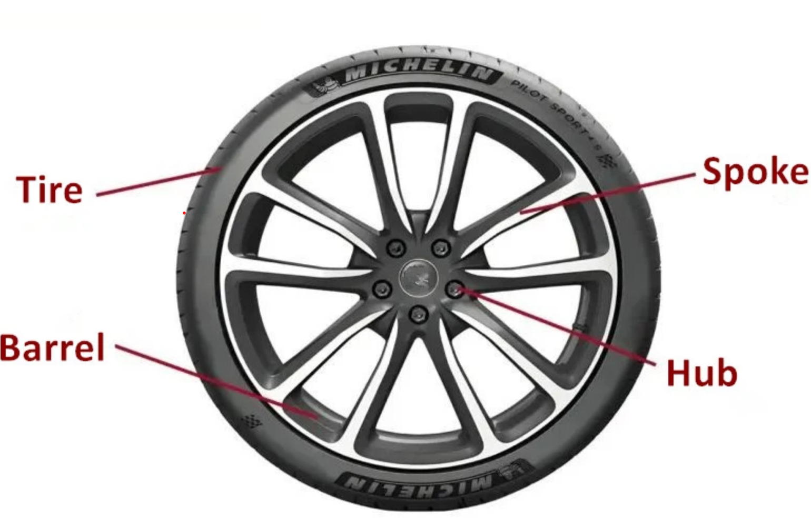
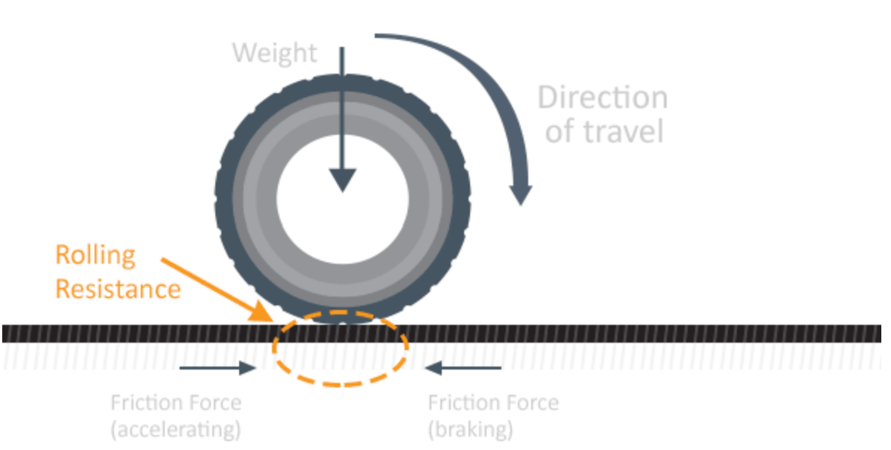

# 3. 모터가 있어도 구르는 것은 바퀴

## 1. 자동차 바퀴 기본 구조 



허브 (Hub): 바퀴의 가장 중앙에 위치하며, 회전축과 차체를 연결하여 동력을 전달하고 베어링을 고정하는 핵심 부품입니다.

스포크 (Spoke): 허브와 바깥쪽의 림을 연결하는 바퀴살입니다 . 바퀴에 가해지는 하중을 분산시키고 회전 시 형태를 유지하는 구조적 지지대 역할을 합니다.

림 (Rim): 휠의 가장자리 둘레 부분으로, 타이어가 장착되고 고정되는 둥근 테두리입니다. 

타이어 (Tire): 림의 바깥쪽에 감싸지는 고무나 금속 재질입니다 . 지면과 직접 닿아 마찰력을 만들고 충격을 흡수합니다.

## 2. 자동차 바퀴 재질

| 재질               | 특징                                                         | 적합한 용도                     |
| ------------------ | ------------------------------------------------------------ | ------------------------------- |
| 플라스틱           | 가볍고 제작이 쉽지만 미끄러지기 쉽다.                        | 아주 가벼운 실습용 로봇         |
| 고무               | 접지력이 좋고 충격 흡수가 좋다. 다만 마모될 수 있다.         | 실내 주행 로봇, 라인트래킹 로봇 |
| 폴리우레탄(PU/TPU) | 내마모성과 탄성이 좋고 하중 지지 능력이 좋다.                | 운반 로봇, AGV, 산업용 바퀴     |
| 금속               | 강도가 높고 무거운 하중을 견딜 수 있지만 바닥 손상과 미끄러짐 문제가 생길 수 있다. | 레일 주행, 중량물 운반 장치     |
| 발포 고무/스펀지   | 충격 흡수가 좋고 가볍지만 내구성이 낮을 수 있다.             | 소형 완충용 바퀴                |

## 3. 마찰력과 관성력

**마찰력이란?**

마찰력은 두 물체가 접촉할 때 상대적인 미끄러짐을 방해하는 힘이다. 바퀴에서는 바퀴의 타이어와 바닥 사이에서 마찰력이 발생한다. 이 마찰력이 충분해야 모터가 바퀴를 돌렸을 때 바퀴가 헛돌지 않고 로봇이 앞으로 이동할 수 있다.

**정치마찰력**

정지 마찰력은 두 물체가 접촉하고 있지만 서로 미끄러지지 않을 때 작용하는 마찰력이다. 바퀴가 바닥 위를 미끄러지지 않고 굴러갈 때, 바퀴와 바닥의 접촉점은 순간적으로 정지해 있는 상태가 된다. 이때 작용하는 마찰력이 정지 마찰력이다.

로봇 바퀴에서 정지 마찰력은 매우 중요하다. 모터가 바퀴를 회전시키면 바퀴는 바닥을 뒤쪽으로 밀고, 바닥은 바퀴를 앞쪽으로 밀어 준다. 이 힘 덕분에 로봇이 앞으로 움직인다.

```text
모터가 바퀴를 회전시킴
→ 바퀴가 바닥을 뒤쪽으로 밀려고 함
→ 바닥이 바퀴를 앞쪽으로 밀어 줌
→ 로봇이 앞으로 이동함
```

정지 마찰력이 충분하면 바퀴는 미끄러지지 않고 안정적으로 굴러간다. 반대로 정지 마찰력이 부족하면 바퀴가 헛돌거나 경로를 벗어날 수 있다.

**동적 마찰력**

동적 마찰력은 두 물체가 서로 미끄러지고 있을 때 작용하는 마찰력이다. 바퀴가 정상적으로 굴러가는 상황에서는 정지 마찰력이 주로 작용하지만, 바퀴가 헛돌거나 미끄러지면 동적 마찰력이 작용한다.

예를 들어 다음과 같은 상황에서 동적 마찰력이 발생할 수 있다.

- 모터 출력이 너무 커서 바퀴가 제자리에서 헛도는 경우
- 바닥이 먼지나 물기로 미끄러운 경우
- 바퀴 재질이 너무 딱딱해 접지력이 부족한 경우
- 급정지나 급회전으로 바퀴가 미끄러지는 경우

동적 마찰력이 발생하면 로봇의 실제 이동 거리가 모터 회전량과 달라진다. 그러면 라인트래킹 로봇은 위치를 정확히 예측하기 어렵고, 주행 경로를 벗어날 가능성이 커진다. 따라서 운반 로봇은 바퀴가 미끄러지지 않도록 적절한 속도 제어와 바퀴 재질 선택이 필요하다.

**관성력이란?**

관성은 물체가 현재의 운동 상태를 계속 유지하려는 성질이다. 정지해 있는 물체는 계속 정지해 있으려 하고, 움직이는 물체는 계속 움직이려 한다.

로봇이 정지 상태에서 출발할 때는 본체와 적재물의 관성을 이겨야 하므로 큰 힘이 필요하다. 반대로 주행 중인 로봇이 멈추려 할 때는 계속 앞으로 가려는 관성 때문에 제동 거리가 생긴다.

**관성력이 바퀴에 적용이 될려면?**

로봇 바퀴에는 두 가지 관성이 함께 작용한다.

1.  로봇 전체의 직선 운동 관성이다. 로봇 본체와 적재물이 무거울수록 출발하거나 멈추기 어렵다. 따라서 운반 로봇은 적재물의 무게를 고려하여 충분한 토크를 가진 모터와 바퀴를 사용해야 한다.
2. 바퀴 자체의 회전 관성이다. 바퀴가 크거나 무거울수록 회전 속도를 바꾸기 어렵다. 따라서 너무 큰 바퀴는 장애물을 넘는 데 유리할 수 있지만, 빠른 가속과 감속에는 불리할 수 있다.





## 4. 구름 저항

**구름 저항이란?**

구름 저항은 바퀴가 바닥 위를 굴러갈 때 운동을 방해하는 저항이다. 미끄러질 때 생기는 마찰과는 다르지만, 바퀴가 실제로 굴러갈 때는 항상 일정한 에너지 손실이 발생한다.

구름 저항이 크면 같은 속도로 이동하기 위해 더 큰 모터 힘과 더 많은 전력이 필요하다. 따라서 배터리로 움직이는 로봇에서는 구름 저항을 줄이는 것이 중요하다.

### **왜 구름 저항이 발생하지?**

구름 저항은 주로 바퀴와 바닥이 완전히 단단한 이상적인 물체가 아니기 때문에 발생한다.

1. 바퀴의 변형
   고무나 폴리우레탄 바퀴는 바닥과 닿을 때 눌리며 조금 변형된다. 바퀴가 회전하면서 이 변형이 반복되고, 변형되었다가 원래 모양으로 돌아오는 과정에서 일부 에너지가 열로 손실된다.
2. 바닥의 변형
   바닥도 완전히 단단하지 않기 때문에 바퀴가 지나가면서 아주 작은 변형이 생길 수 있다. 특히 카펫, 고무 매트, 울퉁불퉁한 바닥에서는 구름 저항이 커진다.
3. 접촉면의 크기
   바퀴와 바닥이 닿는 면적이 클수록 접지력은 좋아질 수 있지만, 변형되는 면적도 커져 구름 저항이 증가할 수 있다. 따라서 접지력과 구름 저항 사이의 균형이 필요하다.
4. 베어링과 축의 마찰
   바퀴가 회전할 때 축이나 베어링에서도 마찰이 발생한다. 베어링 상태가 좋지 않거나 축 정렬이 맞지 않으면 바퀴가 부드럽게 돌지 않아 에너지 손실이 커진다.
5. 바퀴의 정렬 불량
   좌우 바퀴가 평행하지 않거나 바퀴가 흔들리면 이동 방향과 다른 방향으로 불필요한 힘이 생긴다. 이 경우 구름 저항이 증가하고 로봇이 직진하지 못할 수 있다.