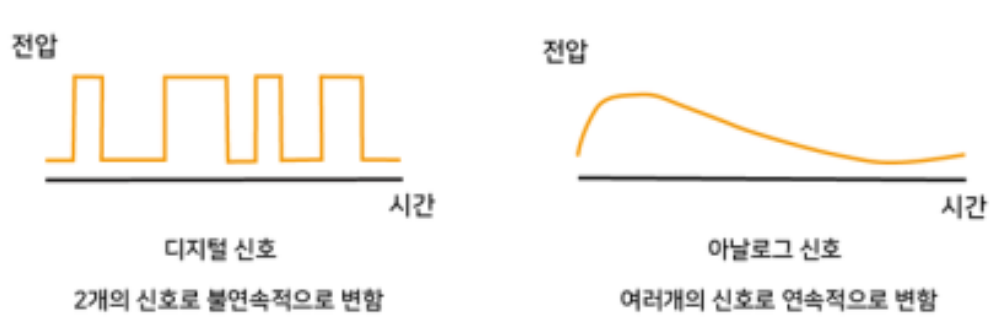

# 4. 센서

**센서란?**

 온도, 빛, 거리, 압력, 속도, 위치, 색상, 반사율 등 물리적인 현상이나 환경 정보를 감지하여 전기적 신호로 변환하는 장치 온도, 빛, 거리, 압력, 속도, 위치, 색상, 반사율 등 물리적인 현상이나 환경 정보를 감지하여 전기적 신호로 변환하는 장치이다. 사람의 눈, 귀, 피부가 주변 정보를 받아들이는 역할을 하듯이, 로봇에서 센서는 외부 환경을 인식하는 역할을 한다.

## 1. 센서의 유형

| 센서 유형   | 감지 대상             | 용도 예시                         |
| ----------- | --------------------- | --------------------------------- |
| 빛 센서     | 밝기, 조도            | 주변 밝기 감지, 자동 조명         |
| IR 센서     | 적외선 반사 또는 차단 | 라인 감지, 근접 감지, 장애물 감지 |
| 초음파 센서 | 초음파 반사 시간      | 거리 측정, 장애물 감지            |
| 온도 센서   | 온도 변화             | 장비 온도 감시, 환경 측정         |
| 압력 센서   | 압력 변화             | 공압 장치, 터치 감지              |
| 가속도 센서 | 가속도, 기울기        | 자세 감지, 충격 감지              |
| 자이로 센서 | 회전 각속도           | 로봇 자세 제어, 방향 유지         |
| 엔코더      | 회전수, 회전 방향     | 모터 속도 측정, 이동 거리 계산    |
| 카메라 센서 | 이미지, 색상, 형태    | 물체 인식, 경로 인식              |

## 2. 센서의 신호 유형

| 구분            | 아날로그 신호              | 디지털 신호                    |
| --------------- | -------------------------- | ------------------------------ |
| 출력 형태       | 연속적인 전압값            | 0 또는 1                       |
| 장점            | 세밀한 변화 감지 가능      | 처리와 판단이 간단함           |
| 단점            | 노이즈 영향이 큼, ADC 필요 | 세밀한 차이 감지가 어려움      |
| 라인트래킹 활용 | 반사율 차이를 수치로 계산  | 검은색/흰색 여부를 간단히 판별 |

## 3. 해상도와 정확도

| 구분   | 의미                                 | 예시                                  |
| ------ | ------------------------------------ | ------------------------------------- |
| 해상도 | 얼마나 작은 차이를 구분할 수 있는가  | 밝기 값을 0~1023 단계로 구분          |
| 정확도 | 측정값이 실제 상태와 얼마나 가까운가 | 검은색 선과 흰색 바닥을 올바르게 판단 |

## 4. 응답 시간과 샘플링 속도

**응답 시간**

응답 시간은 센서가 실제 환경 변화를 감지한 뒤 출력 신호가 그 변화를 반영하기까지 걸리는 시간이다. 응답 시간이 짧을수록 센서가 빠르게 반응한다.

라인트래킹 로봇에서는 응답 시간이 길면 로봇이 이미 검은색 선을 벗어난 뒤에야 센서값이 바뀔 수 있다. 따라서 빠르게 움직이는 로봇일수록 응답 시간이 짧은 센서가 필요하다.

**샘플링 속도**

샘플링 속도는 센서 값을 1초에 몇 번 읽는지를 의미한다. 예를 들어 샘플링 속도가 100Hz라면 1초에 100번 센서 값을 읽는다는 뜻이다.

라인트래킹 로봇에서 샘플링 속도가 너무 낮으면 검은색 선을 지나가는 순간을 놓치거나 방향 수정이 늦어질 수 있다. 반대로 너무 높은 샘플링 속도는 처리할 데이터가 많아져 마이크로컨트롤러에 부담을 줄 수 있다.

## 5. 센서의 노이즈와 필터링

**노이즈란?**

 센서가 측정하려는 실제 신호가 아닌 불필요한 신호나 오차를 의미한다. 센서 신호에 노이즈가 섞이면 측정값이 흔들리거나 잘못된 판단을 할 수 있다.

라인트래킹 로봇에서 는

- 주변 조명 변화
- 형광등이나 햇빛의 적외선 성분
- 바닥 표면의 반사율 차이
- 먼지, 오염, 흠집
- 전원 불안정
- 모터에서 발생하는 전기적 잡음
- 센서와 바닥 사이 거리 변화

이러한 이유로 발생할 것으로 예측된다.

**필터링이란?**

필터링은 센서 신호에서 불필요한 노이즈를 줄이고 필요한 신호를 더 안정적으로 얻기 위한 처리 과정이다.센서값이 순간적으로 튀거나 경계값 근처에서 흔들릴 때 필터링을 적용하면 로봇의 움직임이 더 안정적이 된다.

| 필터링 방법    | 설명                             | 라인트래킹 적용 예시                    |
| -------------- | -------------------------------- | --------------------------------------- |
| 이동 평균 필터 | 최근 여러 개의 센서값을 평균냄   | 센서값이 순간적으로 튀는 현상 완화      |
| 저역 통과 필터 | 빠르게 변하는 노이즈를 줄임      | 급격한 값 흔들림 감소                   |
| 임계값 처리    | 기준값보다 큰지 작은지 판단      | 검은색/흰색 구분                        |
| 히스테리시스   | ON/OFF 기준을 다르게 설정        | 경계 부분에서 출력이 흔들리는 현상 방지 |
| 캘리브레이션   | 검은색과 흰색 기준값을 미리 측정 | 바닥과 조명 조건에 맞게 기준값 보정     |

## IR 센서

적외선을 이용해 물체의 존재, 거리, 표면의 밝기 또는 반사율 차이를 감지하는 센서이다. 라인트래킹에 사용하는 IR 센서는 보통 반사형 IR 센서이다.

반사형 IR 센서는 적외선 LED에서 바닥으로 적외선을 쏘고, 바닥에서 반사되어 돌아오는 빛을 포토트랜지스터나 포토다이오드가 감지한다.

흰색 바닥 → 적외선 반사량 많음 → 센서 출력 변화
검은색 선 → 적외선 흡수량 많음 → 센서 출력 변화

### 라인 트레이싱을 위한 IR 센서의 특성

라인트래킹용 IR 센서는 검은색 선과 흰색 바닥의 반사율 차이를 안정적으로 구분할 수 있어야 한다. 본 프로젝트의 로봇은 하얀색 바닥에 검은색으로 표시된 운송 경로를 따라 이동해야 하므로, IR 반사형 센서가 적합하다.라인트래킹용 IR 센서는 검은색 선과 흰색 바닥의 반사율 차이를 안정적으로 구분할 수 있어야 한다. 본 프로젝트의 로봇은 하얀색 바닥에 검은색으로 표시된 운송 경로를 따라 이동해야 하므로, IR 반사형 센서가 적합하다.

### IR 센서의 신호 처리

IR LED에서 적외선 방출
→ 바닥에서 적외선 반사
→ 수광부가 반사광 감지
→ 아날로그 전압 또는 디지털 신호 출력
→ 마이크로컨트롤러가 센서값 읽기
→ 검은색/흰색 판단
→ 좌우 모터 속도 조절

###  IR 센서 배치 시 유의할 사항

IR 센서는 성능뿐 아니라 배치 방법도 중요하다. 센서를 잘못 배치하면 검은색 선을 제대로 감지하지 못하거나, 로봇이 방향을 늦게 수정할 수 있다.

- 센서는 로봇의 앞쪽 하단에 배치한다.
- 바닥과 센서 사이의 거리를 일정하게 유지한다.
- 센서 간 간격은 검은색 선의 폭에 맞춘다.
- 외부 빛의 영향을 줄이기 위해 차광 구조를 고려한다.
- 광택이 강한 바닥에서는 반사값이 불안정할 수 있으므로 주의한다.
- 주행 전 검은색 선과 흰색 바닥에서 센서값을 측정해 캘리브레이션한다.

# 즉,(정리하면)

센서는 로봇이 외부 환경을 인식하도록 도와주는 입력 장치이다. 센서가 측정한 물리적 정보는 전기 신호로 변환되어 마이크로컨트롤러에 전달되고, 로봇은 이 정보를 바탕으로 모터를 제어한다.

IR 센서는 적외선을 방출하고 반사되어 돌아오는 빛의 양을 측정하여 표면의 반사율 차이를 감지한다. 흰색 바닥은 적외선을 많이 반사하고 검은색 선은 적외선을 많이 흡수하므로, IR 반사형 센서는 라인트래킹 로봇의 라인 감지에 적합하다.